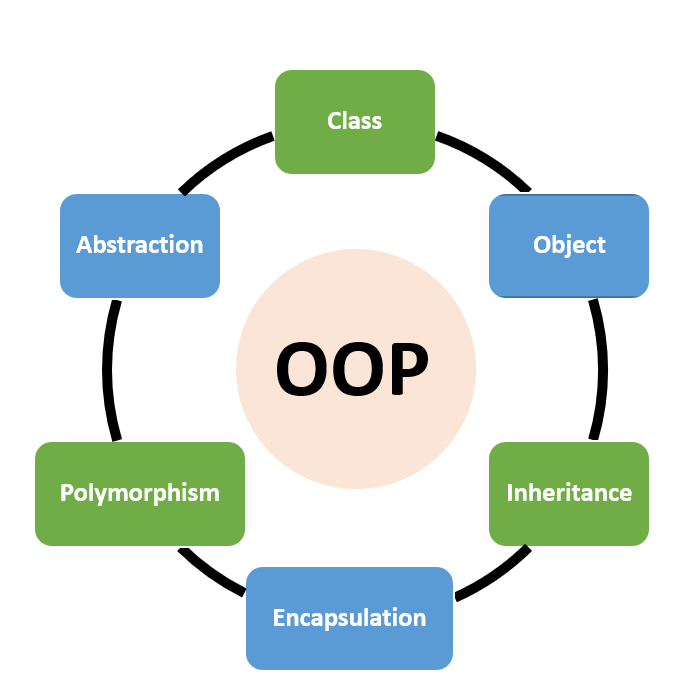

# Learning Object Oriented Python3



<!-- toc -->

- [Overview](#overview)
- [Getting Started with Classes](#getting-started-with-classes)
  * [Constructor Method `__init__`](#constructor-method-__init__)
  * [Typing](#typing)
  * [Assert Validation](#assert-validation)
  * [Class Attributes](#class-attributes)
    + [Exploring Class Vs Instance Attributes Using `__dict__`](#exploring-class-vs-instance-attributes-using-__dict__)
  * [Getting All Instances](#getting-all-instances)
  * [Defining A `__repr__` Method](#defining-a-__repr__-method)
- [Intermediate OOP Topics](#intermediate-oop-topics)
  * [Class Methods](#class-methods)
  * [Static Methods](#static-methods)
  * [Inheritance](#inheritance)
  * [Proper Structuring](#proper-structuring)
  * [Encapsulation and Private Variables](#encapsulation-and-private-variables)
  * [Getters & Setters](#getters--setters)
- [The Four Main Pillars of OOP](#the-four-main-pillars-of-oop)
  * [Encapsulation (Again)](#encapsulation-again)
  * [Abstraction](#abstraction)
  * [Inheritance (Again)](#inheritance-again)
  * [Polymorphism](#polymorphism)
- [Advanced Python OOP Concepts](#advanced-python-oop-concepts)
  * [Design Patterns](#design-patterns)
    + [Creational Patterns](#creational-patterns)
      - [Singleton Pattern](#singleton-pattern)
      - [Factory Pattern](#factory-pattern)
      - [Builder Pattern](#builder-pattern)
    + [Structural Patterns](#structural-patterns)
      - [Adapter Pattern](#adapter-pattern)
      - [Facade Pattern](#facade-pattern)
    + [Behavioral Patterns](#behavioral-patterns)
      - [Observer Pattern (Aka PubSub)](#observer-pattern-aka-pubsub)
      - [Iterator Pattern](#iterator-pattern)
      - [Strategy Pattern](#strategy-pattern)
  * [Solid Principals](#solid-principals)
    + [Single-responsibility](#single-responsibility)
    + [Open-Closed Principle (OCP)](#open-closed-principle-ocp)
    + [Liskov Substitution Principle (LSP)](#liskov-substitution-principle-lsp)
    + [Interface Segregation Principle (ISP)](#interface-segregation-principle-isp)
    + [Dependency Inversion Principle (DIP)](#dependency-inversion-principle-dip)
- [Software Architecture & Design Philosophies](#software-architecture--design-philosophies)
  * [Basic Three Tier Model, View, Controller (MVC) Architecture](#basic-three-tier-model-view-controller-mvc-architecture)
  * [The Clean Architecture](#the-clean-architecture)
  * [Domain-Driven Design (DDD)](#domain-driven-design-ddd)
  * [Hexagonal Architecture](#hexagonal-architecture)
  * [Bringing it All Together](#bringing-it-all-together)
- [Conclusion](#conclusion)
- [Sources](#sources)

<!-- tocstop -->

## Overview

I've hit a wall with what I can achieve using standard python procedural
programming patterns. I need to evolve and I need a refresher on Python OOP
stuff.

I'm at the point where I need to start using factories and constructors and
learn more about design patterns. But still a bit handicapped by basic python
oop stuff. So need to practice.

Based on [this FreeCodeCamp video](https://www.youtube.com/watch?v=Ej_02ICOIgs)

Using bpython as the shell for following along with examples.

## Getting Started with Classes

Basic class

```python3

class Item:
    pass

item1 = Item()
item2 = Item()
```

Classes can have attributes.

```python3
class Item:
    pass

item1 = Item()
item1.name = 'Phone'
item1.price = 100
item1.quantity = 4

print(type(item1))
print(type(item1.name))
print(type(item1.price))
print(type(item1.quantity))
```

Classes also have methods. You probably also know about some builtin methods in
python like string methods.

```python3
mystr = "aaaaaaa"
print(mystr.upper())
```

When we build a class, we can make our own custom methods.

Methods are just functions that live inside of a class.

Methods always take the object it`self` as first argument.

```python3
class Item:

    def calculate_total_price(self, x, y):
        return x * y

item1 = Item()
item1.name = 'Phone'
item1.price = 100
item1.quantity = 4
print(item1.calculate_total_price(item1.price, item1.quantity))

item2 = Item()
item2.name = 'Laptop'
item2.price = 1000
item2.quantity = 3
print(item1.calculate_total_price(item2.price, item2.quantity))

```

As you can see methods take parameters and return results.

### Constructor Method `__init__`

The code above was for demonstration purposes but it sucks.

In reality what we should do when creating a class is define our constructor
method. In python this method is named `__init__` and its responsible for the
initial bit of code that get's run when first creating our object.

```python3
class Item:

    def __init__(self, name, price, quantity=0):
        self.name = name
        self.price = price
        self.quantity = quantity

    def calculate_total_price(self):
        return self.price * self.quantity

iphone_order = Item('iPhone', 100, 4)
print(iphone_order.calculate_total_price())

macbook_order = Item('macbook', 1000, 3)
print(macbook_order.calculate_total_price())
```

> Note: In general in python these sorts of special builtin methods are called
> "dunder" (double underscore) or "magic methods." And we can define lots of
> them to control very interesting object/class behaviors.

You can see with the `__init__` method we're able to refactor our code quite a bit.

Now we can set the object's attributes right when we create it and we can then
also use those attributes in our method without having to pass them in
directly.

We can also see we've set default quantity to zero in the `__init__` method
because we want it that way.

### Typing

Python is a dynamically typed language, meaning a variable's type is checked at
runtime (not compile time). This means we don't have to set a variable type in
python when initializing. That type will be set "implicitly" and determined by
the type of data the variable holds.

However, python does have optional typing that can be applied to function and
method definitions. This serves more as a programmers aid, helping fellow
coders know what type of data to pass to your function / method.

This falls under "best practices" so let's apply some typing to our Item class.

```python3
class Item:

    def __init__(self, name: str, price: float, quantity=0):
        self.name = name
        self.price = price
        self.quantity = quantity

    def calculate_total_price(self):
        return self.price * self.quantity

# iphone_order = Item('iPhone', 100, "4")  # Throws error because expects type int for quantity.

iphone_order = Item('iPhone', 100, 4)
print(iphone_order.calculate_total_price())

macbook_order = Item('macbook', 1000, 3)
print(macbook_order.calculate_total_price())
```

### Assert Validation

We can add some assert statements before our assignments to use as validation.

These assert statements will throw an exception and display our custom message
in the event either the price or quantity is passed in as a negative number.

```python3
class Item:

    def __init__(self, name: str, price: float, quantity=0):
        # Validate args
        assert price >= 0, f"Price {price} cannot be negative"
        assert quantity >= 0, f"Quantity {quantity} cannot be negative"

        # Assign args
        self.name = name
        self.price = price
        self.quantity = quantity

    def calculate_total_price(self):
        return self.price * self.quantity

#iphone_order = Item('iPhone', 100, -4)  # Throws and AssertionError and displays our message

iphone_order = Item('iPhone', 100, 4)
print(iphone_order.calculate_total_price())

macbook_order = Item('macbook', 1000, 3)
print(macbook_order.calculate_total_price())
```

### Class Attributes

These are shared attributes that are the same across all instances of the
class. These attributes belong to the class itself (hence the name), but they
can also be accessed by any individual instance / object.

In our case here we're going to apply a 20% discount to all Items in the store.

```python3
class Item:
    discount = .2

    def __init__(self, name: str, price: float, quantity=0):
        # Validate args
        assert price >= 0, f"Price {price} cannot be negative"
        assert quantity >= 0, f"Quantity {quantity} cannot be negative"

        # Assign args
        self.name = name
        self.price = price
        self.quantity = quantity

    def calculate_total_price(self):
        return (self.price * self.quantity) * (1 - Item.discount)

iphone_order = Item('iPhone', 100, 4)
print(iphone_order.calculate_total_price())

macbook_order = Item('macbook', 1000, 3)
print(macbook_order.calculate_total_price())

# Further listing class vs instance level attirbutes.
print(Item.__dict__)
print(iphone_order.__dict__)
```

As you can see we set our discount to .2 (aka 20%). Then at price cacl time we
apply the discounted rate using the class attribute. This will ensure no matter
what the item quantity or price is, we will have the same discount across them
all.

In the case of the discount, we do not export that and don't allow callers of
our method to use set that discount rate, because we want the class itself to
enforce what that rate is globally.

#### Exploring Class Vs Instance Attributes Using `__dict__`

When it comes to exploring class level attributes vs instance level attributes,
we can print the `__dict__` method for each to get a better understanding. The
`__dict__` method will automatically convert all the data in our class or
object into a dictionary for easier viewing of the whole thing.

Here we can see our `discount` class level attribute when printing the Classes dict:

```python3
>>> print(Item.__dict__)
{'__module__': '__main__', 'discount': 0.2, '__init__': <function Item.__init__ at 0x7f3f2ea3eb00>, 'calculate_total_price': <function Item.calculate_total_price at 0x7f3f2ea3ee60>, '__dict__': <attribute '__dict_
_' of 'Item' objects>, '__weakref__': <attribute '__weakref__' of 'Item' objects>, '__doc__': None}
```

And then here we can see the instance specific vars when printing our `iphone_order` object's dict.

```python3
>>> print(iphone_order.__dict__)
{'name': 'iPhone', 'price': 100, 'quantity': 4}
```

### Getting All Instances

Now that we know about class level variables, let's use one to store a list of
all Item object we create. This will come in handy later on.

```python3
class Item:
    discount = .2
    all = []

    def __init__(self, name: str, price: float, quantity=0):
        # Validate args
        assert price >= 0, f"Price {price} cannot be negative"
        assert quantity >= 0, f"Quantity {quantity} cannot be negative"

        # Assign args
        self.name = name
        self.price = price
        self.quantity = quantity

        # Do needful...
        Item.all.append(self)

    def calculate_total_price(self):
        return self.price * self.quantity

    def apply_discount(self):
        return self.calculate_total_price() * (1 - Item.discount)


item1 = Item("Phone", 100, 1)
item2 = Item("Laptop", 1000, 3)
item3 = Item("Cable", 10, 5)
item4 = Item("Mouse", 50, 5)
item5 = Item("Keyboard", 75, 5)

print(Item.all)
```

As you can see we just make a class level list named `all` and then we go ahead
and append newly instanced item objects to the class level list. Then at the
end after creating some items, we can go ahead and print the class level all
var to get our list.

### Defining A `__repr__` Method

The `__repr__` allows us to print a string representation of our data. The
`__repr__` prints debug / development related information. Much more detailed.
There's a similar magic method called `__str__` which also is meant to print a
string representation of the objects data, however `__str__` is meant to be
user facing, whereas `__repr__` is more for developers.

```python3
class Item:
    discount = .2
    all = []

    def __init__(self, name: str, price: float, quantity=0):
        # Validate args
        assert price >= 0, f"Price {price} cannot be negative"
        assert quantity >= 0, f"Quantity {quantity} cannot be negative"

        # Assign args
        self.name = name
        self.price = price
        self.quantity = quantity

        # Do needful...
        Item.all.append(self)

    def calculate_total_price(self):
        return self.price * self.quantity

    def apply_discount(self):
        return self.calculate_total_price() * (1 - Item.discount)

    # Best practice is for repr to print items in same format as they're instantiated.
    def __repr__(self):
        return f"Item('{self.name}', '{self.price}', '{self.quantity}')"


item1 = Item("Phone", 100, 1)
item2 = Item("Laptop", 1000, 3)
item3 = Item("Cable", 10, 5)
item4 = Item("Mouse", 50, 5)
item5 = Item("Keyboard", 75, 5)

print(Item.all)
```

Now with our `__repr__` method defined we get a much nicer looking list when we
go to print things out.

```
>>> print(Item.all)
[Item('Phone', '100', '1'), Item('Laptop', '1000', '3'), Item('Cable', '10', '5'), Item('Mouse', '50', '5'), Item('Keyboard', '75', '5')]
```

## Intermediate OOP Topics

These next sections we start to get into some more intermediate such as Class
vs Static vs Instance methods and Inheritance.

### Class Methods

Moving forward we're going to store our data in a csv file for ease of use.

* `items.csv`

```csv
name,price,quantity
"Phone",100,1
"Laptop",1000,3
"Cable",10,5
"Mouse",50,5
"Keyboard",75,5
```

With a class level method, (like a class level attribute) we don't have a given
object to use to call the method through. Instead by exporting that method to
the class level, when we call it we just use the class name directly.

We can use the special `@classmethod` decorator to make our method a class
method. Likewise with class methods, instead of passing `self` we pass `cls`
because with a class method, its the class itself that is passed as first
argument to our class method.

```python3
import csv

class Item:
    discount = .2
    all = []

    # Class level methods
    # Creates objects from csv data
    @classmethod
    def instantiate_from_csv(cls):
        with open('items.csv', 'r') as f:
            reader = csv.DictReader(f)
            items = list(reader)

        for item in items:
            print(item)
            Item(
                name=item.get('name'),
                price=float(item.get('price')),
                quantity=float(item.get('quantity')),
            )

    def __init__(self, name: str, price: float, quantity=0):
        # Validate args
        assert price >= 0, f"Price {price} cannot be negative"
        assert quantity >= 0, f"Quantity {quantity} cannot be negative"

        # Assign args
        self.name = name
        self.price = price
        self.quantity = quantity

        # Do needful...
        Item.all.append(self)

    def calculate_total_price(self):
        return self.price * self.quantity

    def apply_discount(self):
        return self.calculate_total_price() * (1 - Item.discount)

    # Best practice is for repr to print items in same format as they're instantiated.
    def __repr__(self):
        return f"Item('{self.name}', '{self.price}', '{self.quantity}')"


Item.instantiate_from_csv()

print(Item.all)

```

When we call the class method we can see it prints all our items as
dictionaries. We then stuff all those item dictionaries into and instantiate
them as Item objects.

Returns:

```python3
{'name': 'Phone', 'price': '100', 'quantity': '1'}
{'name': 'Laptop', 'price': '1000', 'quantity': '3'}
{'name': 'Cable', 'price': '10', 'quantity': '5'}
{'name': 'Mouse', 'price': '50', 'quantity': '5'}
{'name': 'Keyboard', 'price': '75', 'quantity': '5'}
[Item('Phone', '100.0', '1.0'), Item('Laptop', '1000.0', '3.0'), Item('Cable', '10.0', '5.0'), Item('Mouse', '50.0', '5.0'), Item('Keyboard', '75.0', '5.0')]
```

### Static Methods

Static methods are similar to class methods in a few ways. One being that we
use a decorator `@staticmethod` to denote its a static method. Another being it
is scoped to the entire class not the individual instances/objects.

The main difference is that a static method does not take its own class as an
argument. Instead it is just like a function outside of the class where there
is no default first parameter passed to the static method. 

```python3
import csv

class Item:
    discount = .2
    all = []

    # Class level methods
    # Creates objects from csv data
    @classmethod
    def instantiate_from_csv(cls):
        with open('items.csv', 'r') as f:
            reader = csv.DictReader(f)
            items = list(reader)

        for item in items:
            print(item)
            Item(
                name=item.get('name'),
                price=float(item.get('price')),
                quantity=float(item.get('quantity')),
            )

    @staticmethod
    def is_integer(num):
        # Counts 1.0 as int, 1.1 as not int.
        if isinstance(num, float):
            # builtin .is_integer returns True if the float has no fractional part (e.g., 5.0, 10.0).
            return num.is_integer()
        elif isinstance(num, int):
            return True
        else:
            return False

    def __init__(self, name: str, price: float, quantity=0):
        # Validate args
        assert price >= 0, f"Price {price} cannot be negative"
        assert quantity >= 0, f"Quantity {quantity} cannot be negative"

        # Assign args
        self.name = name
        self.price = price
        self.quantity = quantity

        # Do needful...
        Item.all.append(self)

    def calculate_total_price(self):
        return self.price * self.quantity

    def apply_discount(self):
        return self.calculate_total_price() * (1 - Item.discount)

    # Best practice is for repr to print items in same format as they're instantiated.
    def __repr__(self):
        return f"Item('{self.name}', '{self.price}', '{self.quantity}')"


Item.instantiate_from_csv()

print(Item.is_integer('fart'))
print(Item.is_integer(1.0))
print(Item.is_integer(15.0))
print(Item.is_integer(15.7))
```

Returns 
```
False
True
True
False
```

### Inheritance

Say we want to have multiple types of items in our fake store. Some of them are
Phones, some of them are Laptops, etc.

Rather than create three very similar classes with lots of duplicate code, what
we can do instead is create a base class for Item and then extend it with
different more specific type of items class that inherits attributes and
methods from the base class.

In python they use the terms "Parent" and "Child" to refer to the relationship
between classes that related via inheritance.

```python3
import csv

class Item:
    discount = .2
    all = []

    # Class level methods
    # Creates objects from csv data
    @classmethod
    def instantiate_from_csv(cls):
        with open('items.csv', 'r') as f:
            reader = csv.DictReader(f)
            items = list(reader)

        for item in items:
            print(item)
            Item(
                name=item.get('name'),
                price=float(item.get('price')),
                quantity=float(item.get('quantity')),
            )

    @staticmethod
    def is_integer(num):
        # Counts 1.0 as int, 1.1 as not int.
        if isinstance(num, float):
            # builtin .is_integer returns True if the float has no fractional part (e.g., 5.0, 10.0).
            return num.is_integer()
        elif isinstance(num, int):
            return True
        else:
            return False

    def __init__(self, name: str, price: float, quantity=0):
        # Validate args
        assert price >= 0, f"Price {price} cannot be negative"
        assert quantity >= 0, f"Quantity {quantity} cannot be negative"

        # Assign args
        self.name = name
        self.price = price
        self.quantity = quantity

        # Do needful...
        Item.all.append(self)

    def calculate_total_price(self):
        return self.price * self.quantity

    def apply_discount(self):
        return self.calculate_total_price() * (1 - Item.discount)

    # Best practice is for repr to print items in same format as they're instantiated.
    def __repr__(self):
        return f"{self.__class__.__name__}('{self.name}', '{self.price}', '{self.quantity}')"


class Phone(Item):
    def __init__(self, name: str, price: float, quantity=0, broken_phones=0):
        super().__init__(
            name, price, quantity
        )

        # Validate args
        assert broken_phones >= 0, f"Broken Phones {broken_phones} cannot be negative"

        # Assign args
        self.broken_phones = broken_phones


item1 = Item("Laptop", 1000, 2)
phone1 = Phone("iPhone10", 500, 5, 1)
print(phone1.apply_discount())
phone2 = Phone("iPhone13", 700, 5, 1)

print(Item.all)
print(Phone.all)
```

Returns:

```
2000.0
[Item('Laptop', '1000', '2'), Phone('iPhone10', '500', '5'), Phone('iPhone13', '700', '5')]
[Phone('iPhone10', '500', '5'), Phone('iPhone13', '700', '5')]
```

### Proper Structuring

Okay so far we've just been messing around all in the same file. But in the
real world a good rule of thumb is one class per file and the code that
instantiates the objects and works with them should not be in the same file as
the class.

So let's break up our code a bit into an `item.py` file for our Item class, a
`phone.py` file for our class, and finally a `main.py` file to wrap it all up.

```
app/
├── item.py
├── main.py
└── phone.py
```

When doing this we do have to be careful to only include our classes in our
newly created phone.py and main.py files.

* `phone.py`
```python3
from item import Item

class Phone(Item):
    ...
```

* `main.py`
```python3
from item import Item
from phone import Phone

def main():
    ...
```

### Encapsulation and Private Variables

An important principal in object oriented programming is _"Encapsulation"_.

When we write complicated programs we want to bundle up data into objects. As
we've seen so far, we are able to change or mutate an objects data directly
after creating our object. In other words we can create an object and
instantiate it with one name and then on the next line change that name via
`item.name = 'new name'`.

So our objects are mutable from the outside. In this case our data is not
encapsulated. Some code outside of our class file could change the value of
some attribute, which can lead to confusion down the road and is less
maintainable / testable.

To better encapsulate our data, lets enforce some read only elements. We can
use the `@property` decorator in python to make an attribute read only. But
then we have a problem; how do we set our now read only property?

Well in python we can use a single or double underscore before our variable
name in conjunction with @property decorator to make variables private.

The basic difference between one underscore `_var` and two underscores `__var`
is that single underscore's are just protected (hidden) from being set. While
double underscores, make the variable actually totally private to all but the
class.

```python
class MyClass:
    def __init__(self):
        self._hidden = 10
        self.__private = 10

    @property
    def hidden(self):
        return self._hidden

    @property
    def private(self):
        return self.__private

obj = MyClass()

# An automatic alias to "hidden" without the underscore
print(obj.hidden)  # Output: 10

#obj.hidden = 20  # This would raise AttributeError: can't set attribute 'value'

# But can still set _hidden directly.
obj._hidden = 20
print(obj.hidden)  # Output: 20

# Whereas we can't set a private var from outside at all
print(obj.private)  # Output: 10
obj.__private = 20  # Doesn't do anything
print(obj.private)  # Output: 10
```

### Getters & Setters

Now that we've learned about how to hide data away and make it private from the
outside, let's talk about how to access that data and set it if we need to.

We do this by creating a set of methods called `getters` and `setters` that are
allowed to mutate the data within our object. Then, there's only one defined
channel through which our object's data can be accessed or changed, making our
code more modular and reliable.

In python we use the `@<value>.setter` decorator to make a setter method. Let's
look at an example with our Item class.

* `item.py`:

```python3
class Item:

    #...

    def __init__(self, name: str, price: float, quantity=0):
        # Validate args
        assert price >= 0, f"Price {price} cannot be negative"
        assert quantity >= 0, f"Quantity {quantity} cannot be negative"

        # Assign args
        self.__name = name
        self.__price = price
        self.__quantity = quantity

        # Do needful...
        Item.all.append(self)

    @property
    def name(self):
        return self.__name 

    @name.setter
    def name(self, value):
        self.__name = value
```

As you can see, we use `@name.setter` to create a special method that is
allowed to update our private variable.

Then when we go to run it, now once again we are able to set the value of name
to something new via the new setter method.

* `main.py`:

```python3
from item import Item
from phone import Phone

item = Item("myItem", 750)

# Getter is automatically used to get name
print(item.name)

# Setter is automatically used to set new name
item.name = "newItemName"

print(item.name)
```

Prints:

```
newItemName
```

These getters and setters provide a great place to store some basic validation
logic too to check people are setting the var to something the object expects.
For example:

```python3
    @name.setter
    def name(self, value):
        if len(value) > 15:
            raise Exception("Name too long!")

        self.__name = value
```

## The Four Main Pillars of OOP

We've already talked about a couple, but there are four main pillar or
principals of writing well structured object oriented programs.

These are:

* **Encapsulation**: Bundling data (attributes) and the methods that operate on the data within a single unit called a class.
* **Abstraction**: Hiding complex implementation details and showing only the essential features of an object.
* **Inheritance**: A mechanism where a new class (subclass or child class) can inherit properties and behaviors from an existing class (superclass or parent class). 
* **Polymorphism**: The ability for an object to take on many forms. It allows you to treat objects of different classes in a uniform way, often by using a single interface. This means you can call the same method on different objects, and each object will respond in its own way. 

### Encapsulation (Again)

We just talked about encapsulation. But yeah its all about making isolating the
data for the object to within the object and only accessing or changing it via
the getters/setters.

### Abstraction

Abstraction is all about bundling up and exposing only the necessary attributes
and methods for interacting with your specific type of object.

Often times this means not exposing methods that are not used externally. Say
for example you have a complicated class that has to do many different things.

In python, we can use double underscores again with methods this time to make
them private.

```python3
class Email:

    def __init__(self):
        self.smtp_server = 'mail.example.com'
        self.body
        pass

    def __repr__(self):
        pass

    def __connect(self, smtp_server):
        """Make connection to smtp server"""
        pass
        
    def __prepare_body(self, body):
        """Prepare the email body"""
        self.body = f"""
        Hello,

        {body}

        Regards, Me
        """

    def __send(self):
        """Sends the email"""
        pass

    def send_email(self, msg):
        self.connect(self.smtp_server)
        self.prepare_body(msg)
        self.send_msg()

```

As you can see with the code above, we don't want to expose anything except for
the `send_email()` method. Tucking in the coroners and hiding rough edges is an
essential part of abstraction.

### Inheritance (Again)

We talked about inheritance in detail in the section above. But lets take a
step back and talk about why inheritance is useful.

The main idea behind inheritance is move commonalities up the layers of
abstraction. For example, in our fake store code from earlier, we wanted all
items to have the same discount applied to them across the entire store. So we
moved that method into the parent Item class allowing us to apply it globally
from anything that inherits from the Item class.

But abstraction and inheritance aren't limited to one parent and a few children
only. You can have an infinite number of child classes that each inherit from a
parent. You can have grand child and great grand child, and great-great grand
child classes. The key here is that each parent class must be more general, and
each child more specific.

Say for example we want to make a new program to classify all the animals we've
seen today. We could start out with the abstract base class of `Animal`

```python3
# Level 1: Base Parent Classes
class Animal:
    def __init__(self, name):
        self.name = name

    def speak(self):
        print(f"{self.name} makes a sound.")
```

Then as we go through out our day we might see our friend Alice's dog Buddy.

Not only is Buddy an Animal, but he's also a Pet so he has an owner and he's a
Dog. So we can create two new classes to further model and categorize our
animal sightings.

```python3
class Pet:
    def __init__(self, owner):
        self.owner = owner

    def greet_owner(self):
        print(f"{self.name} greets {self.owner}.")

# Level 2: Intermediate Child Class (Multiple Inheritance)
class Dog(Animal, Pet):  # Dog inherits from both Animal and Pet
    def __init__(self, name, owner, breed):
        Animal.__init__(self, name)  # Initialize Animal parent
        Pet.__init__(self, owner)    # Initialize Pet parent
        self.breed = breed

    def speak(self):  # Overriding the speak method from Animal
        print(f"{self.name} barks loudly!")

    def fetch(self):
        print(f"{self.name} is fetching the ball.")


# Create instances and demonstrate inheritance
print("--- Dog Instance ---")
my_dog = Dog("Buddy", "Alice", "Labrador")
my_dog.speak()
my_dog.greet_owner()
my_dog.fetch()
print(f"My dog's name is {my_dog.name} and its owner is {my_dog.owner}.")
```

Then say we went through out the day and we saw a Blue jay out of the window.
We could do the same for it, creating a new class WildAnimal that inherits from
our base Animal class and a new kind of WildAnimal, Bird etc..


### Polymorphism

The last pillar of OOP is Polymorphism.

When describing a function or class as polymorphic, all it means is that thing
behave the same way no matter the underlying form of the thing its acting on.

Let's look at a non-OOP example first from standard python. Specifically, the
builtin `len()` function. Len behaves the same way regardless if its acting on
string or a list or a dictionary, ect..

```python3
x = "Hello World!"
print(len(x))  # Prints 12

mytuple = ("apple", "banana", "cherry")
print(len(mytuple))  # Prints 3

thisdict =	{
  "brand": "Ford",
  "model": "Mustang",
  "year": 1964
}
print(len(thisdict))  # Prints 3
```

In an object oriented context this means we should expect inherited objects to
each have the methods of its parent. In the example below Boat, Car, and Plane
all have a .move() method that can be used to make each do their own type of
movement.

```python3
class Car:
  def __init__(self, brand, model):
    self.brand = brand
    self.model = model

  def move(self):
    print("Drive!")

class Boat:
  def __init__(self, brand, model):
    self.brand = brand
    self.model = model

  def move(self):
    print("Sail!")

class Plane:
  def __init__(self, brand, model):
    self.brand = brand
    self.model = model

  def move(self):
    print("Fly!")

car1 = Car("Ford", "Mustang")       #Create a Car object
boat1 = Boat("Ibiza", "Touring 20") #Create a Boat object
plane1 = Plane("Boeing", "747")     #Create a Plane object

for x in (car1, boat1, plane1):
  x.move()
```

[More info - w3schools.com Polymorphisms](https://www.w3schools.com/python/python_polymorphism.asp)

## Advanced Python OOP Concepts

Okay at this point we've learned a lot about the fundamentals of object
oriented programming in python. We're now moving into some deeper waters that
are much more concerned with high level Object Oriented Design (OOD).

They're about how to build projects not with just one or two classes but with
10-20-100 different classes, all inheriting and interacting with each other.

When I was younger I used to think of these sorta things as optional
"guidelines" to follow to help you not paint yourself into a corner. But as I
get older I realize, these are more than just "best practices" to follow. 

In reality, as a project grows in size and complexity, these standards become
essential in preventing the house of cards from collapsing in on itself.
Everyone has to be on the same page. These are the pages they're on.

### Design Patterns

There are more design patterns out there than we have time to cover today.

However, basically there are three categories for Design Patterns:

1. Creational Patterns: These patterns deal with object creation mechanisms,
aiming to increase flexibility and reuse of existing code.
  * Singleton Pattern: Ensures a class has only one instance and provides a global point of access to it.
  * Factory Method Pattern: Defines an interface for creating an object, but lets subclasses decide which class to instantiate. 
  * Abstract Factory: Provides an interface for creating families of related or dependent objects without specifying their concrete classes. 
  * Builder Pattern: Separates the construction of a complex object from its representation, allowing the same construction process to create different representations.

2. Structural Patterns: These patterns explain how to assemble objects and
classes into larger structures while keeping these structures flexible and
efficient. 
  * Adapter: Allows incompatible interfaces to work together by creating a bridge between them.
  * Bridge: Decouples an abstraction from its implementation so that the two can vary independently.
  * Decorator: Attaches new behaviors or responsibilities to objects dynamically without altering their core structure.
  * Facade: Provides a simplified, higher-level interface to a complex subsystem, making it easier to use.
  * Proxy: Provides a surrogate or placeholder for another object to control access to it.

3. Behavioral Patterns: These patterns are concerned with algorithms and the
assignment of responsibilities between objects, defining how objects interact
and communicate.
  * Chain of Responsibility: Passes requests along a chain of handlers, allowing multiple objects to handle a request without explicitly specifying the receiver.
  * Iterator: Provides a way to access the elements of an aggregate object sequentially without exposing its underlying representation.
  * Mediator: Defines an object that encapsulates how a set of objects interact, promoting loose coupling by keeping objects from referring to each other explicitly.

So there's patterns related to how we create object, patterns related to how we
structure classes and object into larger machines, and patterns related to how
objects behave and interact with each other.

We're not going to cover all of those. But here's a few youtube videos that
lays it all out pretty nicely.

[](https://www.youtube.com/watch?v=tv-_1er1mWI)

[](https://www.youtube.com/watch?v=tAuRQs_d9F8)

[Catalog of Design Patterns](https://refactoring.guru/design-patterns/catalog)

We'll start off by looking at some creational patterns, then hop into a couple
of structural patterns and finish off by going over one or two behavioral
patterns.

#### Creational Patterns

##### Singleton Pattern

The singleton is the highlander pattern "There can only be one!" Its a class
that can only ever have one instance.

```python3
class ApplicationState:
    instance = None

    def __init__(self):
        self.isLoggedIn = False

    @staticmethod
    def getAppState():
        if not ApplicationState.instance:  
            ApplicationState.instance = ApplicationState()
        return ApplicationState.instance

appState1 = ApplicationState.getAppState()
print(appState1.isLoggedIn)

appState2 = ApplicationState.getAppState()
appState1.isLoggedIn = True

print(appState1.isLoggedIn)
print(appState2.isLoggedIn)
```

Output:

```
False
True
True 
```

We can see we have a class level var for instance that'll hold our state
(logged in or not). When we get a second instance, we can see they have the
same state .

##### Factory Pattern

Say we have some code that needs to make burgers. We could make a really
bloated set of classes that inherit from a parent Burger class and instantiate
each separately. But that can become complicated and messy. 

So instead we choose to make a Factory. The factory's whole job is to turn out
different kinds of burger objects.

```python3
class Burger:
    def __init__(self, ingredients):
        self.ingredients = ingredients

    def print(self):
        print(self.ingredients)

class BurgerFactory:
    
    def createCheeseBurger(self):
        ingredients = ["bun", "cheese", "beef-patty"]
        return Burger(ingredients)
    
    def createDeluxeCheeseBurger(self):
        ingredients = ["bun", "tomatoe", "lettuce", "cheese", "beef-patty"]
        return Burger(ingredients)

    def createVeganBurger(self):
        ingredients = ["bun", "special-sauce", "veggie-patty"]
        return Burger(ingredients)

burgerFactory = BurgerFactory()
burgerFactory.createCheeseBurger().print()
burgerFactory.createDeluxeCheeseBurger().print()
burgerFactory.createVeganBurger().print()
```

Output:

```python3
['bun', 'cheese', 'beef-patty']
['bun', 'tomatoe', 'lettuce', 'cheese', 'beef-patty']
['bun', 'special-sauce', 'veggie-patty'] 
```

This way we can decouple the thing that's expecting a burger from the details
about how to make that burger and just give it a standard polymorphic burger
that each implement the bite method.

##### Builder Pattern

A factory is good when you want to build an object all at once, with one call.
However, if you need to build something up layer by layer piecemeal, you'll
want to use a Builder pattern instead.

With a Builder, each method just returns a reference to itself. This allows the
BurgerBuilder caller to construct their burger step by step and chain all the
calls together, because each just returns a ref to self (aka BurgerBuilder
object). Then finally we "build" our object to return the ref to the burger
object we want.

```python3
class Burger:
    def __init__(self):
        self.buns = None
        self.patty = None
        self.cheese = None

    def setBuns(self, bunStyle):
        self.buns = bunStyle
    
    def setPatty(self, pattyStyle):
        self.patty = pattyStyle
    
    def setCheese(self, cheeseStyle):
        self.cheese = cheeseStyle

class BurgerBuilder:
    def __init__(self):
        self.burger = Burger()

    def addBuns(self, bunStyle):
        self.burger.setBuns(bunStyle)
        return self
    
    def addPatty(self, pattyStyle):
        self.burger.setPatty(pattyStyle)
        return self
    
    def addCheese(self, cheeseStyle):
        self.burger.setCheese(cheeseStyle)
        return self  

    def build(self):
        return self.burger

burger = BurgerBuilder() \
            .addBuns("sesame") \
            .addPatty("fish-patty") \
            .addCheese("swiss cheese") \
            .build()
```

#### Structural Patterns

##### Adapter Pattern

An adapter is exactly what it sounds like. We have one object that presents one
type of interface and some code that is expecting a different interface. So we
make a new class that plugs our existing objects interface into a different
type of "socket" (aka downstream code that is expecting object to behave in
standard polymorphic way).

```python3
class UsbCable:
    def __init__(self):
        self.isPlugged = False
    
    def plugUsb(self):
        self.isPlugged = True

class UsbPort:
    def __init__(self):
        self.portAvailable = True
    
    def plug(self, usb):
        if self.portAvailable:
            usb.plugUsb()
            self.portAvailable = False

# UsbCables can plug directly into Usb ports
usbCable = UsbCable()
usbPort1 = UsbPort()
usbPort1.plug(usbCable)

class MicroUsbCable:
    def __init__(self):
        self.isPlugged = False
    
    def plugMicroUsb(self):
        self.isPlugged = True

class MicroToUsbAdapter(UsbCable):
    def __init__(self, microUsbCable):
        self.microUsbCable = microUsbCable
        self.microUsbCable.plugMicroUsb()

    # can override UsbCable.plugUsb() if needed

# MicroUsbCables can plug into Usb ports via an adapter
microToUsbAdapter = MicroToUsbAdapter(MicroUsbCable())
usbPort2 = UsbPort()
usbPort2.plug(microToUsbAdapter)
```

##### Facade Pattern

A facade is similar to an adapter in that both work to convert one interface to
another. But with a facade the name of the game is exposing a clean interface
to the client code.

For example in python, array are automatically dynamically resized. Under the
hood this is just taken care of for the user. If the user tries to extend the
array past the originally initialize size, the facade is in place to
automatically resize the array behind the scenes. This way we just present a
simplified interface to the user.

As mentioned, python does array resizing automatically. But here's what it
would look like if we implemented it ourselves.

```python
# Python arrays are dynamic by default, but this is an example of resizing.
class Array:
    def __init__(self):
        self.capacity = 2
        self.length = 0
        self.arr = [0] * 2 # Array of capacity = 2

    # Insert n in the last position of the array
    def pushback(self, n):
        if self.length == self.capacity:
            self.resize()
            
        # insert at next empty position
        self.arr[self.length] = n
        self.length += 1

    def resize(self):
        # Create new array of double capacity
        self.capacity = 2 * self.capacity
        newArr = [0] * self.capacity 
        
        # Copy elements to newArr
        for i in range(self.length):
            newArr[i] = self.arr[i]
        self.arr = newArr
        
    # Remove the last element in the array
    def popback(self):
        if self.length > 0:
            self.length -= 1 
```

#### Behavioral Patterns

##### Observer Pattern (Aka PubSub)

The observer pattern is often described as one to many or publisher /
subscriber model.

Basically, you have one observer that is watching for changes in state. Then
you have multiple subscribers that are plugged into the observer to get
messages, to control events down stream.

```python3
class YoutubeChannel:
    def __init__(self, name):
        self.name = name
        self.subscribers = []

    def subscribe(self, sub):
        self.subscribers.append(sub)
    
    def notify(self, event):
        for sub in self.subscribers:
            sub.sendNotification(self.name, event)

from abc import ABC, abstractmethod

class YoutubeSubscriber(ABC):
    @abstractmethod
    def sendNotification(self, event):
        pass

class YoutubeUser(YoutubeSubscriber):
    def __init__(self, name):
        self.name = name
    
    def sendNotification(self, channel, event):
        print(f"User {self.name} received notification from {channel}: {event}")

channel = YoutubeChannel("neetcode")

channel.subscribe(YoutubeUser("sub1"))
channel.subscribe(YoutubeUser("sub2"))
channel.subscribe(YoutubeUser("sub3"))

channel.notify("A new video released")
```

In this case we have multiple Subscribers listening to a single published. But
users could also be subscribed to multiple channels.  Since the Publishers &
Subscribers don't have to worry about each others' implementations, they are
loosely coupled.

Output:
```
User sub1 received notification from neetcode: A new video released
User sub2 received notification from neetcode: A new video released
User sub3 received notification from neetcode: A new video released 
```

##### Iterator Pattern

Most python programmers are familiar with at least using an Iterator. All the
default python data types are Iterators. You can use the `in` keyword in python
to move through an Iterator.

```python
# Uses the builtin list iterator
mylist = [1,2,3]
for n in mylist:
    print(n)
```

However, with more complicated objects and datastructure we can build our own
interator by overwriting the `__next__` dunder method.

In the example below we create a custom LinkedList class and show how it can be
used as an iderator.

```python3
class ListNode:
    def __init__(self, val):
        self.val = val
        self.next = None

class LinkedList:
    def __init__(self, head):
        self.head = head
        self.cur = None

    # Define Iterator
    def __iter__(self):
        self.cur = self.head
        return self

    # Iterate
    def __next__(self):
        if self.cur:
            val = self.cur.val
            self.cur = self.cur.next
            return val
        else:
            raise StopIteration

# Initialize LinkedList
head = ListNode(1)
head.next = ListNode(2)
head.next.next = ListNode(3)
myList = LinkedList(head)

# Iterate through LinkedList
for n in myList:
    print(n) 
```

Outputs:

```python3
1
2
3 
```

##### Strategy Pattern

Strategy: Defines a family of algorithms, encapsulates each one, and makes them
interchangeable, allowing the algorithm to vary independently from the clients
that use it.

A Class may have different behaviour, or invoke a different method based on
something we define (i.e. a Strategy). For example, we can filter an array by
removing positive values; or we could filter it by removing all odd values.
These are two filtering strategies we could implement, but we could add many
more.

```python3
from abc import ABC, abstractmethod

class FilterStrategy(ABC):

    @abstractmethod
    def removeValue(self, val):
        pass

class RemoveNegativeStrategy(FilterStrategy):

    def removeValue(self, val):
        return val < 0 

class RemoveOddStrategy(FilterStrategy):

    def removeValue(self, val):
        return abs(val) % 2


class Values:
    def __init__(self, vals):
        self.vals = vals
    
    def filter(self, strategy):
        res = []
        for n in self.vals:
            if not strategy.removeValue(n):
                res.append(n)
        return res

values = Values([-7, -4, -1, 0, 2, 6, 9])

print(values.filter(RemoveNegativeStrategy()))
print(values.filter(RemoveOddStrategy()))
```

Output:
```python3
[0, 2, 6, 9]
[-4, 0, 2, 6] 
```

All of the above Python Design Patterns code stolen from here:

[Neetcode Design Patterns Code](https://neetcode.io/courses/lessons/8-design-patterns)

### Solid Principals

We talked about the four pillars earlier (Encapsulation, Abstraction,
Inheritance, Polymorphism). I like to think of solid principals as like an
add-on to the four main pillars. Like as if someone said "yeah the four pillars
are the essence of OOP, but here's five more rules to help re-enforce things a
bit." And you'll see echos of the four pillars in the Solid principals.

Solid is an acronym and it stands for:

* Single-responsibility principle (SRP)
* Open–closed principle (OCP)
* Liskov substitution principle (LSP)
* Interface segregation principle (ISP)
* Dependency inversion principle (DIP)

A lot of the below is blatantly ripped from here:

[Real Python - Solid Principals](https://realpython.com/solid-principles-python/)

I'm just compiling it all here in this one doc for my notes.

#### Single-responsibility

The single-responsibility principle (SRP) comes from Robert C. Martin, more
commonly known by his nickname Uncle Bob, who’s a well-respected figure in
the software engineering world and one of the original signatories of the
Agile Manifesto. In fact, he coined the term SOLID.

The single-responsibility principle states that:

>    A class should have only one reason to change.

So if we have a class that is being utilized for two different things, break it
up into multiple classes.

```python3
from pathlib import Path
from zipfile import ZipFile

class FileManager:
    def __init__(self, filename):
        self.path = Path(filename)

    def read(self, encoding="utf-8"):
        return self.path.read_text(encoding)

    def write(self, data, encoding="utf-8"):
        self.path.write_text(data, encoding)

    def compress(self):
        with ZipFile(self.path.with_suffix(".zip"), mode="w") as archive:
            archive.write(self.path)

    def decompress(self):
        with ZipFile(self.path.with_suffix(".zip"), mode="r") as archive:
            archive.extractall()
```

Compression and decompressions are unrelated to the normal read and write
operations of our `FileManager`. So Single-Responsibility Principle (SRP) says
we should break this up into two different classes that each do their own
thing.

```python3
from pathlib import Path
from zipfile import ZipFile

class FileManager:
    def __init__(self, filename):
        self.path = Path(filename)

    def read(self, encoding="utf-8"):
        return self.path.read_text(encoding)

    def write(self, data, encoding="utf-8"):
        self.path.write_text(data, encoding)

class ZipFileManager:
    def __init__(self, filename):
        self.path = Path(filename)

    def compress(self):
        with ZipFile(self.path.with_suffix(".zip"), mode="w") as archive:
            archive.write(self.path)

    def decompress(self):
        with ZipFile(self.path.with_suffix(".zip"), mode="r") as archive:
            archive.extractall()

```

#### Open-Closed Principle (OCP)

The open-closed principle (OCP) for object-oriented design was originally
introduced by Bertrand Meyer in 1988 and means that:

> Software entities (classes, modules, functions, etc.) should be open for
> extension, but closed for modification.

So basically its a principal saying our classes should go from generic base
class to more specific and be extensible, but not mutable. We should be able to
build off of them, without having to modify the base class.

For example, Say we have this shape class:

```python3
from math import pi

class Shape:
    def __init__(self, shape_type, **kwargs):
        self.shape_type = shape_type
        if self.shape_type == "rectangle":
            self.width = kwargs["width"]
            self.height = kwargs["height"]
        elif self.shape_type == "circle":
            self.radius = kwargs["radius"]

    def calculate_area(self):
        if self.shape_type == "rectangle":
            return self.width * self.height
        elif self.shape_type == "circle":
            return pi * self.radius**2
```

You can see we're using it to get the area for either a rectangle or a circle.

But what if we wanted to add to this? Its not very clean and extensible.

So instead what we can do to refactor this is use an _Abstract Base Class
(ABC)_ to create a generic Shape class. This base class defines an "interface"
via `.calculate_area()` that our specific Square, Rectangle, Circle classes can
all overwrite and implement.

```python3
from abc import ABC, abstractmethod
from math import pi

class Shape(ABC):
    def __init__(self, shape_type):
        self.shape_type = shape_type

    @abstractmethod
    def calculate_area(self):
        pass

class Circle(Shape):
    def __init__(self, radius):
        super().__init__("circle")
        self.radius = radius

    def calculate_area(self):
        return pi * self.radius**2

class Rectangle(Shape):
    def __init__(self, width, height):
        super().__init__("rectangle")
        self.width = width
        self.height = height

    def calculate_area(self):
        return self.width * self.height

class Square(Shape):
    def __init__(self, side):
        super().__init__("square")
        self.side = side

    def calculate_area(self):
        return self.side**2
```

So now without having to modify our Shape class we can extend it with even more
shapes without polluting one class with lots of if statements.

#### Liskov Substitution Principle (LSP)

The Liskov substitution principle (LSP) was introduced by Barbara Liskov at an
OOPSLA conference in 1987. Since then, this principle has been a fundamental
part of object-oriented programming. The principle states that:

> Subtypes must be substitutable for their base types.

In practice, this principle is about making your subclasses behave like their
base classes without breaking anyone's expectations when they call the same
methods. To continue with shape-related examples, say you have a Rectangle
class like the following:

```python3
class Rectangle:
    def __init__(self, width, height):
        self.width = width
        self.height = height

    def calculate_area(self):
        return self.width * self.height
```

You might be tempted to build your Square class off of the Rectangle class
making sure to tweak the setter so that with or height will work to set the
sides length for your square.

```python3
class Square(Rectangle):
    def __init__(self, side):
        super().__init__(side, side)

    def __setattr__(self, key, value):
        super().__setattr__(key, value)
        if key in ("width", "height"):
            self.__dict__["width"] = value
            self.__dict__["height"] = value
```

But by doing so you've broken Polymorphism and violated the Liskov Substitution
Principle.

```python3
>>> from shapes_lsp import Square

>>> square = Square(5)
>>> vars(square)
{'width': 5, 'height': 5}

>>> square.width = 7
>>> vars(square)
{'width': 7, 'height': 7}

>>> square.height = 9
>>> vars(square)
{'width': 9, 'height': 9}
```

Somebody working with our module might think that square behaves the same as
rectangle or circle or anything that inherits from the base Shape class, but
now it doesn't and that breaking of assumptions is the violation of the Liskov
Substitution Principle.

#### Interface Segregation Principle (ISP)

The interface segregation principle (ISP) comes from the same mind as the
single-responsibility principle. Yes, it's another feather in Uncle Bob's cap.
The principle's main idea is that:

> Clients should not be forced to depend upon methods that they do not use.
> Interfaces belong to clients, not to hierarchies.

This is that same as what we talked about with abstraction generally, hiding
things away and breaking things out into separate pieces.

Consider the following example of class hierarchy to model printing machines:

```python3
from abc import ABC, abstractmethod

class Printer(ABC):
    @abstractmethod
    def print(self, document):
        pass

    @abstractmethod
    def fax(self, document):
        pass

    @abstractmethod
    def scan(self, document):
        pass

class OldPrinter(Printer):
    def print(self, document):
        print(f"Printing {document} in black and white...")

    def fax(self, document):
        raise NotImplementedError("Fax functionality not supported")

    def scan(self, document):
        raise NotImplementedError("Scan functionality not supported")

class ModernPrinter(Printer):
    def print(self, document):
        print(f"Printing {document} in color...")

    def fax(self, document):
        print(f"Faxing {document}...")

    def scan(self, document):
        print(f"Scanning {document}...")
```

We can see our OldPrinter class has some methods that are not implemented
because the old printer doesn't support that functionality.

This implementation violates the ISP because it forces OldPrinter to expose an
interface that the class doesn't implement or need. To fix this issue, you
should separate the interfaces into smaller and more specific classes. 

```python3
from abc import ABC, abstractmethod

class Printer(ABC):
    @abstractmethod
    def print(self, document):
        pass

class Fax(ABC):
    @abstractmethod
    def fax(self, document):
        pass

class Scanner(ABC):
    @abstractmethod
    def scan(self, document):
        pass

class OldPrinter(Printer):
    def print(self, document):
        print(f"Printing {document} in black and white...")

class NewPrinter(Printer, Fax, Scanner):
    def print(self, document):
        print(f"Printing {document} in color...")

    def fax(self, document):
        print(f"Faxing {document}...")

    def scan(self, document):
        print(f"Scanning {document}...")
```

Now Printer, Fax, and Scanner are base classes that provide specific interfaces
with a single responsibility each. To create OldPrinter, you only inherit the
Printer interface. This way, the class won’t have unused methods. To create the
ModernPrinter class, you need to inherit from all the interfaces. In short,
we've segregated the Printer interface.

#### Dependency Inversion Principle (DIP)

The dependency inversion principle (DIP) is the last principle in the SOLID
set. This principle states that:

> Abstractions should not depend upon details. Details should depend upon
> abstractions.

That sounds pretty complex. Here's an example that will help to clarify it. Say
you're building an application and have a FrontEnd class to display data to the
users in a friendly way. The app currently gets its data from a database, so
you end up with the following code:

```python3
class FrontEnd:
    def __init__(self, back_end):
        self.back_end = back_end

    def display_data(self):
        data = self.back_end.get_data_from_database()
        print("Display data:", data)

class BackEnd:
    def get_data_from_database(self):
        return "Data from the database"
```

In this example, the FrontEnd class depends on the BackEnd class and its
concrete implementation. You can say that both classes are tightly coupled. 

You may think of adding a new method to BackEnd to retrieve the data from the
REST API. However, that will also require you to modify FrontEnd, which should
be closed to modification, according to the open-closed principle.

To fix the issue, you can apply the dependency inversion principle and make
your classes depend on abstractions rather than on concrete implementations
like BackEnd. In this specific example, you can introduce a DataSource class
that provides the interface to use in your concrete classes:

```python3
from abc import ABC, abstractmethod

class FrontEnd:
    def __init__(self, data_source):
        self.data_source = data_source

    def display_data(self):
        data = self.data_source.get_data()
        print("Display data:", data)

class DataSource(ABC):
    @abstractmethod
    def get_data(self):
        pass

class Database(DataSource):
    def get_data(self):
        return "Data from the database"

class API(DataSource):
    def get_data(self):
        return "Data from the API"
```

In this redesign of your classes, you've added a DataSource class as an
abstraction that provides the required interface, or the `.get_data()` method.
Note how FrontEnd now depends on the interface provided by DataSource, which is
an abstraction.

Basically, rather than casing on type of data source then fetching from the one
specified, dependency inversion lets us pass an abstract interface to the data
source (whatever it might be). Then our method for displaying the data doesn't
need to care what data source we're working with, because they all implement the
`.get_data()` method, so it can work with any of them.

## Software Architecture & Design Philosophies

So far we've talked about SOLID Principals, the four main pillars, and design
patterns. But now its time to go up yet another level of abstraction and
discuss ideas about software architecture.

Software architecture is the sort of high level strategic view of a software
application. Experienced folks will advise that you begin with architecture
when designing a new project because it is these details that become harder to
change as the project grows in complexity.

|              Hierarchy of Software Design Concepts                     |
| ---------------------------------------------------------------------- |
| Software Architecture > Software Design > Implementation/Code Patterns |

So far everything we've talked about has been Software Design and
implementation details. Software Architecture is how we take our Design
Principals & Patterns and stitch them together to build complex systems.

Its worth noting that while the ideas discussed below are separate and distinct
from one another, they are by no means contradictory philosophies. It isn't MVC
vs DDD vs Clean Arch vs Hexagonal Arch as if each was a dogmatic paradigm with
radically different takes on how to design software systems.

Rather like many traditions in philosophy, these ideas often complement, are
based off of, and barrow from one another. They are all different lenses one
can use to view the process of building complex software systems.

### Basic Three Tier Model, View, Controller (MVC) Architecture

Lots of people harp on at length about MVC and the various similar derivatives,
but the basic structure is this:


Under MVC, we split the application up into three distinct components, each
with different responsibilities.

* Model: Data layer of application (concrete example: The ORM class that defines your tables schema and available methods)
* View: Presentation layer, UI components, Display of data from model (concrete example: The template for the page that presents info and interface to controller (ie. forms))
* Controller: Interface between View & Model. Translates user input to changes to Model and correspondingly updates View to reflect changes. (concrete example: Route code that handles POST requests and does needful)

The view doesn't ever interact with the model directly. Instead all model
changes are handled by the controller and info about the new state of the model
is relayed back through the controller up to the view.

Here's what a typical MVC order of operations looks like:

1. User makes request to the controller.
2. Controller interacts with the model to fetch or change data.
3. Data is returned from the model to the controller.
4. Controller passes information to the view to render it.
5. View passes rendered results back to Controller.
6. Controller returns results to end user.

There's more to it than that and countless variations on that basic model but
its not worth getting deeper into here.

The real power behind this architectural pattern is the separation of concerns.
The Model never talks to the View and vice versa. The model only does data, the
view only does presentation, and the controller only does core business logic.

### The Clean Architecture

The next architecture we're going to talk about is another idea from Uncle Bob
called _"The clean architecture"_.


I'm basing these note's off [this talk I watched on the subject](https://www.youtube.com/watch?v=DJtef410XaM) by Brandon Rhodes from PyOhio 2014.

The main idea behind the clean pattern is very simple. Uncle Bob argues that
we've been writing functions backwards this whole time. The typical use of a
function is to wrap up and hide complexity behind a layer of abstraction. To
make the messy business of `do_x_thing()` simple.

However, Bob argues this is the wrong approach. Instead he says what we ought
to be doing is having the actual external interactions (IO, DB Calls, API
Requests, ect.) happen in the outer most layer, in the client code and then
have our inner sub routines be purely functional in nature.

To express it another way:

> An "Imperative shell" that wraps and uses your "Functional Core."

So like the inner most modules shouldn't "do" anything. They just take in one
data structure and spit out another data structure.

For example, let's say we wanted to add a feature to our project to get the
definition for a word via an external web api. A lot of programmers would just
write a function like this to abstract away complexity and handle the messy
business for you. 

* Basic Non-Clean Arch Example:

```python
import requests
from urllib import urlencode

def find_definition(word):
    q = 'define ' + word
    url = 'http://api.duckduckgo.com/?'
    url += urlencode({'q': q, 'format': 'json'})

    response = requests.get(url)
    data = response.json()
    definition = data[u'Definition']

    if definition == u'':
        raise ValueError('that is not a word')
    return definition
```

* Arch Diagram:

```
↘
  Proceedure
```

The problem with this code is that it buries I/O deep in the core of your
business logic. So for example, when the API becomes deprecated (which this one
has), we have to rewrite the whole function.

When re-factoring this code, it might be tempting to continue making the same
mistake uncle Bob argues we've been making for the last 60 years and hide away
that complexity once again behind a new function. However, in the process of
making a new func to wrap our api call, we yet again bury our I/O even deeper.

* Non-Clean Arch Refactored Example:

```python
def find_definition(word):
    q = 'define ' + word
    url = 'http://api.duckduckgo.com/?'
    url += urlencode({'q': q, 'format': 'json'})

    data = call_json_api(url)
    definition = data[u'Definition']

    if definition == u'':
        raise ValueError('that is not a word')
    return definition

def call_json_api(url):
    response = requests.get(url)  # I/O
    data = response.json()        # I/O
    return data
```

* Arch Diagram:

```
↘
  Proceedure
             ↘ 
               i/o subroutine
```

So we've hidden the I/O, but we haven't cleanly de-coupled it.

Now one way we could continue going here, is to use some sort of dependency
inversion here. For example in our test code would pass in a mock
`call_json_api()` function, we could do some monkey patching to replace
requests with our own mock requests library with a custom `.get()` method etc.

However, uncle Bob says there's a better way. What if instead we inverted the
IO an brought it out to the outer rim of our program.

* Clean Arch Refactored Example:

```python
# Outer Imperative Shell
def find_definition(word):
    url = build_url(word)
    data = requests.get(url).json()  # I/O
    return pluck_definition(data)

# Inner Functional Core
def build_url(word):
    q = 'define' + word
    url = 'http://api.duckduckgo.com/?'
    url += urlencode({'q': q, 'format': 'json'})

def pluck_definition(data):
    definition = data[u'Definition']
    if definition == u'':
        raise ValueError('that is not a word')
    return definition
```

* Arch Diagram:

```
↘
  Proceedure
             ↘ 
               pure function
             ↘ 
               pure function
```

With this example, we've put the data operations in our inner functions, while
pulling out the I/O to the outer edge.

So now our downstream functions don't have side effects. They simply take some
args that are data, and return some results that are data.

This has incredible ramifications for testing. Now we can test our inner
functions without having to do any mocking or monkey patching. We just feed it
a data structure and double check that the results are what we're expecting.

The key here is a clear separation of concerns. While our outer layers depend
on our core logic, our core logic should Not depend on things in the outer
layer. It should remain decoupled and modular, allowing us to swap out
components as things change and evolve over time.

### Domain-Driven Design (DDD)


[](https://www.youtube.com/watch?v=4rhzdZIDX_k)

This approach comes from Eric Evans 2003 Book _"Domain-Driven Design"_.

Under DDD, we start our design process by breaking down the problems our
software is trying to solve into separate specific "domains" and "sub-domains."

For example, let's say we were to build a streaming service from scratch. What
would be our domain? Well one way we could break it down is like this:

* Video Stream (Core Domain)
* Recommendations 
* Billing
* Etc.

From there we can then move on to figure out the key parts of each of those
domains.

Before we can do that though we need to talk about language. A big thing in DDD
is use of "Ubiquitous Language" which really just means everyone needs to be on
the same page and use the same words when talking about things that fall under
a specific domain. 


When we break down a given domain into key components, we might find that
several domain share common attributes. So our billing and recommendation and
streaming domains probably all contain some soft of object representing a user
account. But under the billing domain context they call them, customers.
Whereas under the streaming domain they call them subscribers.

DDD deals with this by having us define "Boundary Contexts" so we don't need to
get the whole business to agree on what to call subscribers, we just need to
agree what to call them within each domain. To enforce this boundary we create
what's called "an anti-corruption layer" which translates what an object is
called and what it means when passed between domains.

Once we've outlined our domains and their components, we then define a "Context
Map" which outlines which domains communicate with each other and the direction
of that communication.

The next step is to use "Tactical Design" to figure out what objects for each
domain (aka our Domain Objects). Domain objects come in two forms:

* Entity Objects: Unique mutable objects with unique IDs, if all attribs the same but IDs differ, they're different objects.
* Value Objects: Non-unique immutable objects with no ID, if all attribs the same, they're the same object.

For example, a User would be an Entity Object, because when a user changes
their Email address or profile picture, it's still the same user account.

Whereas, we'd use a value object to save the Email address. Of course we could
always save the email address to a boring string. But using a value object
allows us to make string value hidden (with no setters) and we can pack logic
into the constructor, which can be useful when doing something like validating
an email address. We don't need to validate all throughout our code because we
know it was validated when the value object was instantiated.

So entity objects typically contain many value objects. And then when we have a
collection of entities, we call that an _Aggregate_. Aggregates are often used
to make up _Transactional Boundaries_ where when changes are made to the
aggregate, these changes are then committed or rolled back from the database.

Finally, we have _Repositories_ and _Services_.

Repositories are the data access layer. They provide an interface to persistent
storage and often use the language of a database, implementing `.add()` and
`.remove()` methods. Repositories are not for individual entity or value
object, but rather handle whole aggregates.

Services in DDD are stateless collections of methods that don't make sense to
add to any one entity object. Say for example you need to do a calculation
involving multiple entity objects.

### Hexagonal Architecture

[](https://www.youtube.com/watch?v=bDWApqAUjEI)

Previously, in this document we discussed the Adapter pattern that can be used
to plug a square peg into a round hole. The hexagonal arch takes this idea and
extends it to entire application to create highly decoupled and modular pieces.

Alistair Cockburn who came up with the hexagonal arch realized that there
wasn't much difference between interacting with a database or interacting with
an external API / application. So instead of having our application call the
database directly, we just need it to call a _Port_ interface that implements a
read and write method and an adapter that plugs into that port which connects
to the database or file system or message queue or whatever.


This way the application code can remain highly decoupled. You can swap out
adapters add day long and as long as they plug into the port, the inner
application code doesn't need to care what they are or know anything about
them.

But its not just outputs that can use this ports and adapters pattern. We can
describe these two sides as the "Driving Side" and the "Driven Side."

However, a Hexagon in this metaphor is a stand-in for a single component of
your application. In reality, your application will likely be built up of
several interlocking hexagons to form a tiling of modular components.

This highly decoupled design has huge benefits for maintainability and
testability as it becomes easy to test individual components in isolation and
if something ever breaks or becomes deprecated, its easy enough to swap out the
pieces.

However, this comes at the cost of complexity. Instead of writing directly to a
database, we have to impose several new software layers and abstractions
between that. This takes time to write and more lines of code == more liabilities.

### Bringing it All Together

As mentioned previously, these ideas are largely complimentary and fit together
quite nicely.

For example, let's make synthesize these models in conjunction with one another
to lay out a basic software project.

We'll start with a basic Three Tier Architecture where we have a clear
separation between Presentation, Data Access, & Control layers. We'll borrow
ideas from Uncle Bob's Clean Architecture and say the outer most layer is our
presentation layer and data access layer and in the core lies our controller
logic. When defining this inner core we can apply the principals learned from
Domain Driven Design to break our business logic down into domain specific
areas of concern, and then when decoupling things for individual domains we can
apply what we've learned about the hexagonal architecture and ports and
adapters to make sure our individual components are modular, maintainable, and
testable.

## Conclusion

These are John's notes on object oriented programming in python3.

I'm excited to get into this stuff more and write more oop code do more ood.
However, I'm also aware that OOP is A) time consuming to write and B) overkill
in certain situations. 

However, at this point I do believe its unfortunately somewhat necessary to
dive into to allow my projects to scale. The mountains of spaghetti code need
structure if they're going to grow taller. 

## Sources

* [FreeCodeCamp YouTube - Object Oriented Programming with Python](https://www.youtube.com/watch?v=Ej_02ICOIgs)
* [w3schools.com - Polymorphisms](https://www.w3schools.com/python/python_polymorphism.asp)
* [Fireship Youtube - Design Patterns](https://www.youtube.com/watch?v=tv-_1er1mWI)
* [NeetCode Youtube - Design Patterns](https://www.youtube.com/watch?v=tAuRQs_d9F8)
* [Refactoring Guru - Catalog of Design Patterns](https://refactoring.guru/design-patterns/catalog)
* [Neetcode.io - Design Patterns Code](https://neetcode.io/courses/lessons/8-design-patterns)
* [Real Python - Solid Principals](https://realpython.com/solid-principles-python/)
* [GeeksForGeeks - Differences between Software Design and Software Architecture](https://www.geeksforgeeks.org/system-design/difference-between-software-design-and-software-architecture/)
* [Brandon Rhodes PyOhio Talk - The Clean Architecture in Python](https://www.youtube.com/watch?v=DJtef410XaM)
* [Alex Hyett Youtube - Domain Driven Design](https://www.youtube.com/watch?v=4rhzdZIDX_k)
* [Eric Evans - Domain-Drive Design PDF](https://fabiofumarola.github.io/nosql/readingMaterial/Evans03.pdf)
* [Opus.ch - DDD Service & Repository Patterns](https://opus.ch/ddd-concepts-and-patterns-service-and-repository/)
* [Alex Hyett Youtube - Hexagonal Architecture](https://www.youtube.com/watch?v=bDWApqAUjEI)

<br><hr>
[🔼 Back to top](#learning-object-oriented-python3)
